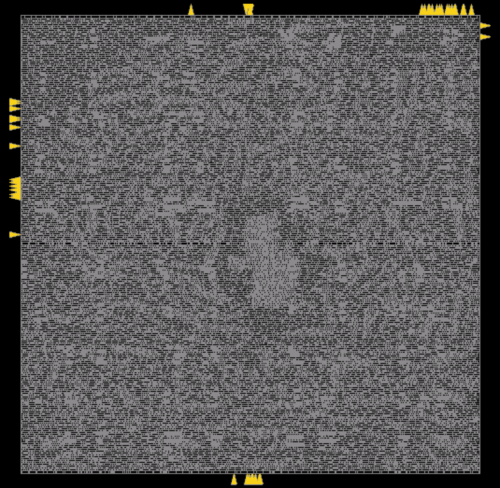
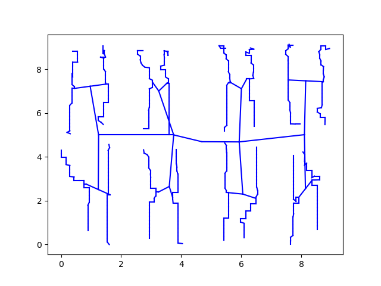
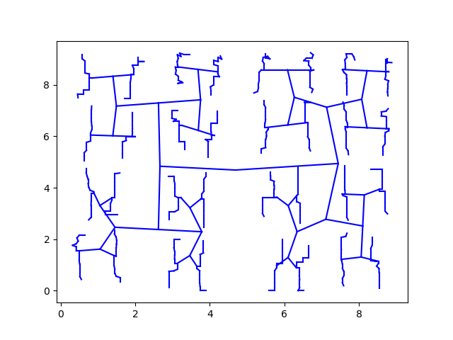
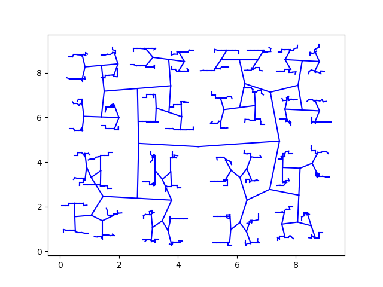

# TritonCTS 

### Original work
K. Han, A. B. Kahng and J. Li, "Optimal Generalized H-Tree Topology and Buffering for High-Performance and Low-Power Clock Distribution", IEEE Trans. on CAD (2018), [doi:10.1109/TCAD.2018.2889756](https://doi.org/10.1109/TCAD.2018.2889756).

Many subsequent changes for open-sourcing were made by [Mateus Fogaça](https://github.com/mpfogaca).

### Inputs and outputs
TritonTCS requires 5 input files and produces 3 output files. Refer to [OpenROAD Flow and Notes](https://theopenroadproject.org/wp-content/uploads/2018/12/OpenROAD_Flow_and_Notes_Nov2018-v1p0-1.pdf) for more information.

Inputs:
- [Library characterization file] (doc/Technology_characterization.md)
- Verilog with gate-level netlist
- Placed DEF with netlist
- [Configuration file](doc/Run_TritonCTS.md#example-of-a-config-file)

Outputs:
- Placed DEF with clock buffers
- Verilog with clock buffers
- Route guides in ISPD18 format

### Supported features / assumptions
- 1 clock source;
- Core origin must be (0, 0);
- DEF database units must be equal to 1000 dbu per micron;
- No support for non-default rules (NDRs) in the clock routing.

** TritonCTS is currently under a pre-alpha release. The list of features and limitations may change significantly in the future. The target for alpha release is June 2019.

### Validation
TritonCTS has been validated for the following list of platforms, tools and enablements.

| Feature | Support |
|---|---|
| Operating system | CentOS 6 |
| Compiler  | GCC 4.4.7 |
| Enablements | ST28 and TSMC16 |
| CPLEX | Version 12.8 |
| TCL | Version 8.4.20 |
| Python | Version 2.7.12 |

### Tutorials
---
- [Run the library characterization](doc/Technology_characterization.md)
- [Run TritonCTS](doc/Run_TritonCTS.md)

### Example

Below we display the design _jpeg_encoder_ implemented in TSMC16 with 42K intances, followed by TritonCTS routing topology targeting 150, 100 and 50ps skew.

|  |
|:--:|
| *Visualized examples of jpeg_encoder with TSMC16 with 42K instances* |

|  |  |  | 
|:--:|:--:|:--:| 
| *jpeg_encoder targeting 150ps skew* | *jpeg_encoder targeting 100ps skew* | *jpeg_encoder targeting 50ps skew* |
