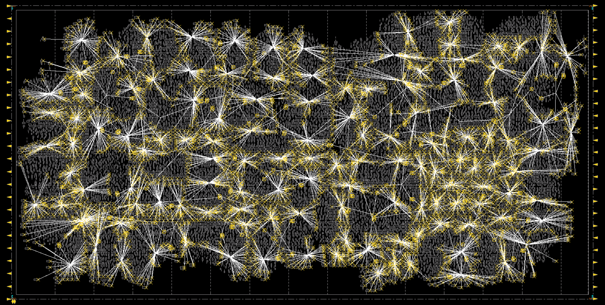
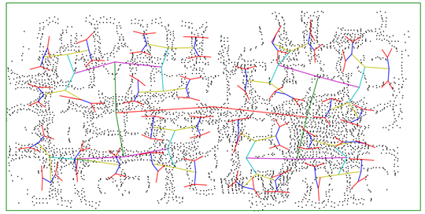

# TritonCTS 

### ------------------------------- WARNING --------------------------------
### :bangbang: This version of TritonCTS has been retired from the OpenROAD flow. :bangbang: 

### :bangbang: You can find TritonCTS 2.0 [here](https://github.com/The-OpenROAD-Project/OpenROAD/tree/master/src/TritonCTS). :bangbang:
### --------------------------------------------------------------------------

### Original work
K. Han, A. B. Kahng and J. Li, "Optimal Generalized H-Tree Topology and Buffering for High-Performance and Low-Power Clock Distribution", IEEE Trans. on CAD (2018), [doi:10.1109/TCAD.2018.2889756](https://doi.org/10.1109/TCAD.2018.2889756).

Many subsequent changes for open-sourcing were made by [Mateus Fogaça](https://github.com/mpfogaca).

### Inputs and outputs
TritonCTS requires 5 input files and produces 2 output files. Refer to [OpenROAD Flow and Notes](https://theopenroadproject.org/wp-content/uploads/2018/12/OpenROAD_Flow_and_Notes_Nov2018-v1p0-1.pdf) for more information.

Inputs:
- [Library characterization files](doc/Technology_characterization.md)
- Verilog with gate-level netlist
- Placed DEF with netlist
- [Configuration file](doc/Run_TritonCTS.md#example-of-a-config-file)

Outputs:
- Placed DEF with clock buffers
- Verilog with clock buffers

### Supported features / assumptions
- 1 clock source;

### Validation
TritonCTS has been validated for the following list of platforms, tools and enablements.

| Feature | Support |
|---|---|
| Operating system | CentOS 6 |
| Compiler  | GCC 4.4.7 |
| Enablements | ST28 and TSMC16 |
| TCL | Version 8.4.20 |
| Python | Version 2.7.12 |
| [Lemon](https://lemon.cs.elte.hu/trac/lemon) | Version 1.3.1 |

### Tutorials
- [Run the library characterization](doc/Technology_characterization.md)
- [Compile and run TritonCTS](doc/Run_TritonCTS.md)

### Example
Below we display the clock nets for the design jpeg_encoder implemented in TSMC65 with 24K instances, followed by TritonCTS routing topology.

|  |
|:--:|
| *TritonCTS generated clock nets for jpeg_encoder* |

|  |
|:--:| 
| *TritonCTS clock tree topology for jpeg_encoder* |

