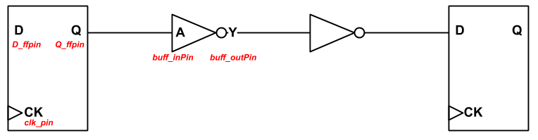

# Technology characterization

These steps generate lookup tables for buffered or non-buffered wire segments delimited by flip-flops. The lookup tables are used as building blocks for clock tree construction and store information about delay, power and slew of the wire segments. 

|  |
|:--:|
| *A buffered wire segment delimited by two flip-flops* |

*** These steps are required per foundry/IP enablement, since the enablement is visible only under NDA, and often readable only by foundry-qualified tools. Please refer to [OpenROAD Flow and Notes](https://theopenroadproject.org/wp-content/uploads/2018/12/OpenROAD_Flow_and_Notes_Nov2018-v1p0-1.pdf) for a better understanding of supported technologies and current limitations / assumptions.

- Change directory to _genLUT_ folder.

```
$ cd ../genLUT
```

 - Update the following variables in _template/config.tcl_ accordingly:
 
   * list_lib - Path to you library files.
     * E.g.: _set list_lib "path/to/my/library.lib"_
   * cap_unit - Must set to 1 if your library has _pF_ as capacitance unit or 1000 if your library has _fF_ as capacitance unit.
     * E.g.: _set cap_unit 1_
   * time_unit - Must set to 1 if your library has _ns_ as timing unit or 1000 if your library has _ps_ as timing unit.
     * E.g.: _set time_unit 1_
   * bufTypes - List of standard cells to be used as clock buffers.
     * E.g.: _set bufTypes "BUF_X1 BUF_X2 BUF_X4 BUF_X16 BUF_X32"_
   * Q_ffpin - Name of the output data pin of the library flip-flops.
     * E.g.: _set Q_ffpin "Q"_
   * D_ffpin - Name of the input data pin of the library flip-flips.
     * E.g.: _set D_ffpin "D"_
   * buff_inPin - Name of the input pin of the library buffers.
     * E.g: _set buff_inPin "A"_
   * buff_outPin - Name of the output pin of the library buffers.
     * E.g.: _set buff_outPin "Y"_
   * clk_pin - Clock signal pin name of the library flip-flips.
     * E.g.: _set clk_pin "CK_
   * bufName - Library buffer to be used as a placeholder at the beginning of the characterization.
     * E.g.: _set bufName "BUF_X16"_
   * FFName - Library flip-flop to be used in the end of the wire during characterization. 
     * E.g.: _set FFName "FF_X2"_
   * cellHeight - Height of your library cells in _um_.
     * E.g.: _set cellHeight "0.5"_
   * cap_per_unit_len - Capacitance per unit length of your technology. Use your technology units and update only the value after the keyword _expr_
     * E.g.: _set cap_per_unit_len [expr (0.8 / 1000) * $cap_unit ]_
   * res_per_unit_len - Resistance per unit length of your technology. Use your technology units and update only the value after the keyword _expr_
     * set _res_per_unit_len [expr (0.9 / 1000) * $cap_unit ]_ # Assumes cap and res multipliers are the same
   * initial_cap_interval - used for rounding to the nearest capacitance value during characterization for fine-grained change of output load
	    * E.g: _set initial_cap_interval 0.001 #Assumes the capacitance units are in fF_
   * final_cap_interval - used for rounding to the nearest capacitance value during characterization for coarse-grained change of output load.
	    * E.g: _set final_cap_interval 0.005 #Assumes the capacitance units are in fF_

* We encourage you to **DO NOT** change the following variables unless you **REALLY** know what you are doing.
   * maxSlew, inputSlew, slewInter - max, min and step for slew in characterization scripts.
     * E.g.: _set maxSlew [expr 0.060 * $time_unit]_
     * E.g.: _set inputSlew [expr 0.005 * $time_unit]_
     * E.g.: _set slewInter [expr 0.005 * $time_unit]_

   * outloadNum, baseLoad, loadInter - Number of loads, min load value and step for the characterization scripts. For the last two, only change the value after _expr_ using your library units.     
     * E.g.: _set outLoadNum 34_
     * E.g.: _set baseLoad [expr 0.005 * $cap_unit]_
     * E.g.: _set loadInter [ expr 0.005 * $cap_unit]_

 - Run the characterization script, _run_all.tcl_ (a valid OpenSTA binary under _genLUT_ is required).

- After _run_all.tcl_ script has finished, make sure that a file named _XX.lut_ exists under each generated folder. The characterization folders have the naming convention: _test_XX_YY_NDR_, where _XX_ is the dist, _YY_ is the _unit_dist_ and _NDR_ is the non-default rule. When characterizing for larger values of _dist_ (e.g. _dist_=80 um), on a single core the expected runtime is around 1 hour or less depending on your local setup.

- Edit variable _lutList_ in _genLUTOpt2.tcl_ with the paths of the _XX.lut_ files

- Run the _genLUTOpt2.tcl_ script:

```
$ ./genLUTOpt2.tcl > concat.lut
```

- Run _prep_lut.tcl_
```
$ ./prep_lut.tcl concat.lut
```

- Copy the result files, _sol_list.txt_ and _lut.txt_, to TritonCTS/src/tech folder, renaming them according to your technology node.

For example, if you are using ST28, you would rename as:
```
$ cp sol_list.txt ../../src/tech/sol_list-28.txt
```
```
$ cp lut.txt ../../src/tech/lut-28.txt
```

For example, if you are using TSMC16, you would rename as:
```
$ cp sol_list.txt ../../src/tech/sol_list-16.txt
```
```
$ cp lut.txt ../../src/tech/lut-16.txt
```

- To check your setup, please verify the following:
    *   Folders _test_XX_YY_NDR_
    *   Non-empty _XX.lut_ file under each _test_XX_YY_NDR_ folder.
    *   Non-empty _sol_list-XX.txt_ file under ../../src/tech
    *   Non-empty _lut-XX.txt_ file under ../../src/tech

- You may now [run TritonCTS]().
